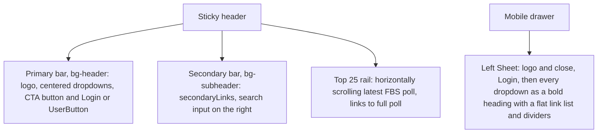

# Redesign apps/web (On3-style refresh)

All work happens on the existing `feature/update-the-design` branch and ships together.

## References and ground rules

- **Visual reference:** the v0 clone at `/Users/jamessingleton/Downloads/on3-website-clone-2` is only an example of what's possible, for layout ideas such as the megaboard, Top 25 card, article layout and portal wire. The look itself comes from the Design direction above, and content comes from Sanity and Postgres.
- **What not to reuse from the clone:**
  - its header structure (the navigation follows on3.com instead, see section 3)
  - `lib/data.ts` mock data
  - the roughly 2,700 lines of `on3-*` and `tp-*` CSS (rebuild everything with Tailwind utilities)
  - `lib/admin-store.ts` and the unauthenticated `api/admin/players` routes
- **Data sources:** existing Sanity queries and `@redshirt-sports/db` only.
- **No hex codes in class names.** No `text-[#E80022]`, `bg-[#000]` or similar; use semantic tokens such as `text-brand`, `bg-brand`, `text-primary` and `bg-header`.

## Design direction

The design plan below follows the `frontend-design` and `design-taste-frontend` skills. Each section is followed by a review against generic defaults.

**Design read:** a college sports news site for fans of smaller programs (FCS, D2, D3), in the language of a sports-media brand, built on Tailwind v4, shadcn and Cache Components. This is an overhaul of the visuals that keeps all existing URLs and content.

**Dials:**
- Design variance: 6. The site uses an editorial grid that varies in rhythm, but an ordinary grid layout.
- Motion intensity: 4. Motion appears only through view transitions that answer user actions.
- Visual density: 6. A news site should be content-dense.

### Palette

All colors are CSS variables in `globals.css` and are never written as hex in class names.

- **Redshirt Red `#E80022`:** the existing brand color, from the logo and `themeColor`. Used for `brand`/`primary`, active states and rank movement.
- **Stadium Navy `#0F1B2D`:** the primary header, footer and Top 25 rail. It replaces On3's black and the generic near-black.
- **Field Paper `#F6F7F9`:** the page background, a cool off-white (deliberately not cream).
- **Chalk `#E2E5EA`:** borders and dividers.
- **Press Box Slate `#5A6473`:** muted text such as bylines and timestamps.
- **Dark mode:** navy-based surfaces (around `#0B1422` and `#132238`) with the same red, keeping WCAG AA contrast.

### Type

- **One family: Archivo**, a variable font with a width axis, loaded through `next/font/google` in place of Geist.
- **Headlines:** condensed, black weight, tight leading.
- **Body:** normal width at 400 to 500 weight, about 65 characters per line in articles.
- **Rankings:** rank numbers, points and records use tabular figures.
- No monospace font.

### Signature element

Spend the boldness in one place: rank numerals. Rankings set in oversized condensed black Archivo carry the brand on the Top 25 rail, in `Top25Card` and on the poll page. Everything else stays quiet: one radius scale (4px on cards and images, full pill on chips and tabs), no gradients and no decorative shadows.

### Review against generic defaults

- "Near-black plus a single red accent" is a known cliché, so the header is navy rather than black. The red is kept because it is the existing brand color.
- No all-caps eyebrows above every heading. Sections use sentence-case condensed headings. The mobile drawer's section headings are bold sentence case rather than On3's tracked uppercase.
- No `·`-joined metadata strings, no `→` on links and no em dashes in copy.
- Numbered markers are used only where the content really is ranked (polls, portal rankings), not on lists of latest headlines.
- Keep `lucide-react`, which the project already uses: one icon family with a consistent stroke width.

### Motion (`vercel-react-view-transitions`)

- **Shared element:** a card image morphs into the article hero, using `<ViewTransition name={`post-image-${_id}`}>` on both sides.
- **Directional navigation:** links from listing pages to articles carry the `nav-forward` transition type.
- **Suspense reveals:** `Top25Card`, the rail and the voter breakdown fade from skeleton to content.
- **List identity:** switching rankings tabs (FBS to FCS) and the "load more" button on the portal wire use keyed `ViewTransition` items.
- **Reduced motion:** add the reduced-motion CSS from the skill's recipes to `globals.css`.

## shadcn/ui conventions (`shadcn` skill)

- **Where components live:** shared primitives are in `packages/ui/src/components/`, configured by [packages/ui/components.json](packages/ui/components.json). [apps/web/components.json](apps/web/components.json) aliases `ui` to `@redshirt-sports/ui/components`. The style is new-york with Radix and lucide icons.
- **Adding components:** use the CLI from `packages/ui`, for example `pnpm dlx shadcn@latest add tabs toggle-group item empty spinner field input-group`.
  - Check `pnpm dlx shadcn@latest info` and `docs <component>` before using a component.
  - Check registries with `pnpm dlx shadcn@latest search` before writing custom UI.
  - Export new components through the `packages/ui` package.json exports.
- **Which component for which job:**
  - Header dropdowns: `NavigationMenu`
  - Mobile drawer: `Sheet` with `SheetTitle`, plus `Separator`
  - Search: `InputGroup` in the secondary bar, `Command` + `Dialog` for the quick-find dialog
  - Top 25 division switch: `Tabs` (with `TabsTrigger` inside `TabsList`)
  - Poll page and portal wire tables: `Table`
  - Portal filters: `Select`, with a `Sheet` holding the filters on mobile
  - Status chips: `Badge`
  - Bylines: `Avatar` with `AvatarFallback`
  - Loading states: `Skeleton` matching the final layout
  - Empty states: `Empty`
  - Load-more button: `Button` with `Spinner`
  - Admin portal forms: `FieldGroup`/`Field`
  - Delete confirmation: `AlertDialog`
- **Styling rules:**
  - Theme only through the CSS variables in `globals.css`: `--primary` is the brand red, `--radius` is set to the 4px scale, plus the new brand and header tokens. Use semantic classes such as `bg-primary`, `text-muted-foreground` and `bg-header`.
  - `className` is for layout only, not for overriding component colors or typography.
  - Use built-in variants before custom styles, and add any new variants with `cva` in the component source.
  - Use `gap-*` instead of `space-*`, `size-*` for equal width and height, and `cn()` for conditional classes.
  - No manual `dark:` color overrides and no manual `z-index` on overlay components.
- **Fonts:** the Tailwind v4 font issue noted in the skill applies here. Put literal font family names (`"Archivo", ...`) in `@theme inline`, and put the `next/font` variable class on `<html>`.

## Data, caching and Sanity conventions

- **Real data only.** Every section is driven by Sanity or Postgres. The clone is just an example of what's possible. If a section has no data (for example a sport with no posts, or an empty week), it is hidden or shows an empty state with a next step. It never shows placeholder content.
- **Section-to-source map:**
  - Nav: the `navbar` document
  - Footer: the `footer` and `settings` documents
  - Megaboard and section lists: `queryHomePageData`, `queryLatestArticles` and `queryLatestCollegeSportsArticles`
  - Sport hubs and conference filters: `sport`, `division` and `conference` documents
  - Top 25 rail and cards: `getLatestFinalRankings` and the related functions in `@redshirt-sports/db`
  - Team pages: Sanity `school` plus ranking history from Postgres
  - Transfer portal: the new Postgres tables, joined to `schools` (which carries `sanity_id` for logos)
- **Cache Components** (`next-cache-components`, `sanity-live-cache-components`): already enabled in [apps/web/next.config.ts](apps/web/next.config.ts) with `cacheLife.default = sanity`.
  - Reuse the existing helpers: `sanityFetchPage` in [apps/web/lib/sanity-fetch.ts](apps/web/lib/sanity-fetch.ts) (the shared `'use cache'` boundary), `draftAwarePage`/`draftAwareParamsPage`/`searchParamsPage` in [apps/web/lib/draft-cache.tsx](apps/web/lib/draft-cache.tsx), and `sanityFetchMetadata`/`sanityFetchStaticParams` in [packages/sanity/src/live.ts](packages/sanity/src/live.ts).
  - Postgres reads use function-level `'use cache'`, plus `cacheTag` and `cacheLife(RANKINGS_CACHE_LIFE)` as in `rankings-data.ts`. Transfer portal reads get their own tags so admin writes can call `updateTag`.
  - Keep a single `<SanityLive>` in `root-layout-chrome.tsx`.
  - Never put `'use cache'` on a top-level page that awaits `params`, `searchParams` or `cookies`.
- **Sanity** (`sanity-best-practices`):
  - Use typed `defineQuery` queries in `packages/sanity/src/queries.ts`.
  - Project only the fields the new components render, which keeps the server-to-client payload small.
  - Make schema changes additive, and deploy them before reading the new fields.
  - Run `pnpm type` after any schema change.

## Problems being fixed

- **Article hero grows unbounded.** In [apps/web/components/sanity-image.tsx](apps/web/components/sanity-image.tsx), `{...processedImageData}` is spread after the explicit `width`/`height`, so the source image's real dimensions win. The article page also has no aspect-ratio wrapper around it.
- **The nav is overly complex.** [apps/web/components/navbar-client.tsx](apps/web/components/navbar-client.tsx) (about 420 lines) duplicates desktop and mobile markup. Its data comes from `globalNavigationQuery`, a large GROQ query with nested `count()` calls that builds menus for every conference. The `navbar` Sanity document and `queryNavbarData` already exist but are unused.
- **Top 25 is hard to find.** It is only linked from the nav and team pages, and there is no stable "latest poll" URL.

## 1. Foundation: tokens

All tokens go in [packages/ui/src/styles/globals.css](packages/ui/src/styles/globals.css), with light and dark values.

- **CSS variables:**
  - `--brand` (red) and `--brand-foreground`
  - `--header` and `--header-foreground` (the dark primary bar)
  - `--subheader` (the light secondary bar)
  - Point `--primary` at the brand red.
- **Tailwind mapping:** expose them through `@theme inline`:

```css
@theme inline {
  --color-brand: var(--brand);
  --color-brand-foreground: var(--brand-foreground);
  --color-header: var(--header);
  --color-header-foreground: var(--header-foreground);
  --color-subheader: var(--subheader);
}
```

- **Usage:** classes become `bg-brand`, `text-brand`, `bg-header text-header-foreground`, and so on.
- **Admin app:** these styles are shared with the admin app, so check it visually.
- **Typography:** switch to Archivo through `next/font` in `apps/web/app/layout.tsx`. Condensed black headlines, normal-width body text, tabular figures for rankings.
- **Container:** widen to about 1400px max.
- **Image fix:** in `CustomImage`, spread `processedImageData` first, then explicit `width`/`height`.

## 2. Sanity navbar schema

The existing schema in [apps/studio/schemaTypes/documents/navbar.ts](apps/studio/schemaTypes/documents/navbar.ts) already matches On3's primary bar. On3's dropdowns are single flat lists, not multi-column mega menus.

- `navbarColumn` (title plus links) maps to a dropdown: the title is the trigger label and the links are the items.
- `navbarLink` maps to a plain top-level link.

Changes needed are small, so no migration is required. Make them additive:

- **Rename for clarity:** rename the field titles to "Dropdown Menu" and "Primary Navigation". Keep the field names so existing content still works.
- **New fields:**
  - `secondaryLinks`: an array of `navbarLink` for the light second bar, such as Top 25 Rankings, Teams, Football News and Vote.
  - `cta`: an optional `navbarLink` for the primary-bar button, for example "Join Now" or "Vote".
- **Query:** update `queryNavbarData` in [packages/sanity/src/queries.ts](packages/sanity/src/queries.ts) to project the new fields. Then run `pnpm type` in `apps/studio`.
- **Seed content:** add menus with editorial links, for example:
  - College: Football News, Basketball News, FBS, FCS, D2, D3
  - Rankings: links to the stable latest-poll URLs from section 5
  - Teams
  - About
  - Transfer Portal is left out until launch.
- **Removals:** delete `globalNavigationQuery`, `getCachedNavbarLatestRankings` and the hardcoded `divisionDisplayNames`.

## 3. Site chrome (follows on3.com, per your screenshots)



- **Rewrite [apps/web/components/navbar.tsx](apps/web/components/navbar.tsx) and `navbar-client.tsx`:**
  - Use the shadcn `NavigationMenu` with `viewport={false}` so dropdowns are small panels anchored under their trigger, not full width.
  - Desktop and mobile render from the same Sanity data.
  - The mobile drawer has no collapsibles: every section is expanded, as on On3.
- **Top 25 rail:**
  - A server component fed by the latest FBS final rankings, like On3's score strip.
  - Shows rank, logo and short name, scrolls horizontally on mobile, and ends with a "Full Top 25" link.
  - It sits on every page, which gives the polls constant visibility.
- **Search:** the secondary-bar input submits to the existing `/search` page.
- **Restyle [apps/web/components/footer.tsx](apps/web/components/footer.tsx)** with `bg-header`. It stays Sanity-driven.

## 4. Shared content components (`apps/web/components/`)

- **`ArticleCard` variants:** `ArticleCardLarge` (overlay), `ArticleCardMedium` (16:9), `ArticleCardHorizontal` and `ArticleCardSmall`. These are explicit components rather than boolean props, and every image sits in an `aspect-*` box with `object-cover`.
- **`SectionHeader`:** title, optional badge and a "View All" link.
- **`Megaboard`:** replaces `home/hero.tsx` with a 2/3 + 1/3 grid.
- **`HeadlineList`:** a compact list of the latest headlines, each with a relative timestamp, beside the Megaboard. No rank numbers, because the list is not ranked.
- **`Top25Card`:**
  - A server component using a cached wrapper in [apps/web/lib/rankings-data.ts](apps/web/lib/rankings-data.ts) built on `getLatestFinalRankings`.
  - A client tab switcher for FBS / FCS / D2 / D3, with an optional `division` prop to pin one poll.
  - Shows the top 10, then a "Full poll" link.

## 5. Top 25

- **New route** `apps/web/app/college/[sport]/rankings/[division]/page.tsx`: renders the latest week, giving the nav, the rail and SEO a stable URL. Add it to `rankings/sitemap.ts`.
- **Restyle** the week page `.../[year]/[week]/page.tsx` in the clone's style: movement icons, the others-receiving-votes and dropped-out lists, and a horizontally scrolling voter breakdown with a sticky voter column.
- **Where Top 25 appears:**
  - the header rail, on every page
  - the homepage sidebar
  - the article sidebar
  - the sport and division listing pages
  - the team page

## 6. Homepage ([apps/web/app/page.tsx](apps/web/app/page.tsx))

- **Top:** Megaboard, with `HeadlineList` beside it on desktop.
- **Below:** On3's pattern of sections on the left, each paired with a sidebar widget on the right:
  - College Sports (latest) with `Top25Card`
  - FBS with a vote/join call to action
  - FCS, D2, D3 and Basketball, if they have posts
- Keep the existing deduplication of already-shown posts.

## 7. Article page ([apps/web/app/[slug]/page.tsx](apps/web/app/[slug]/page.tsx))

- **Header:** a category kicker built from the sport, division and conference badges, a large `font-black` title, and a byline bar with avatar, author, date and share icons.
- **Layout:** `grid lg:grid-cols-[1fr_320px]`.
- **Hero:** inside `aspect-video overflow-hidden rounded-lg`, with `object-cover` and the credit caption.
- **Body:** capped at about `max-w-2xl`.
- **Sticky sidebar:** "More from {sport}" (horizontal cards from `relatedPosts`), then `Top25Card` pinned to the article's division.

## 8. Remaining pages

- **News listings:** `college/news`, `college/[sport]/news`, and the `[division]` and `[conference]` pages.
  - Lead story first, then a card list, with a Top 25 sidebar.
  - A conference filter row replaces the conference lists that used to be in the nav.
- **New `college/[sport]/page.tsx`:** sport hub with news by division plus Top 25.
- **Other pages:**
  - `college/teams/[slug]`
  - `authors/[slug]`
  - `search`, `about`, `contact`, `legal/[slug]`
  - the `(auth)` pages, including vote and onboarding
  - These need container, typography and card swaps.
- **Loading states:** update the `loading.tsx` skeletons.

## 9. Transfer portal (built, not exposed)

Reference pages: the clone's `app/transfer-portal/wire/football/2025/page.tsx` and on3.com/transfer-portal/wire/football.

- **Database** in [packages/db/src/schema.ts](packages/db/src/schema.ts): port the clone's model, adapted to the existing tables. Do not copy the clone's `schools` or `conferences`, which collide with yours.
  - `high_schools`
  - `players`: slug, name, position, height, weight, `academic_year` enum, hometown, `high_school_id`, `sport_id` → `sports`
  - `transfer_portal_entries`: `player_id`, `status` enum (ENTERED, COMMITTED, SIGNED, ENROLLED, WITHDRAWN), `portal_year`, `from_school_id` and `to_school_id` → existing `schools.id`, the per-status timestamps, and `event_date`, with the cursor-pagination indexes
  - `player_school_history`
  - Follow the repo conventions: text uuid IDs and `CURRENT_TIMESTAMP` defaults. Generate the migration with `pnpm db:generate`.
- **Queries** in `packages/db/src/queries/transfer-portal.ts`:
  - `getTransferPortalEntries` (filters for status, position, conference and search, with cursor pagination)
  - `getPortalStatusCounts`
  - `getPlayerBySlug`
  - `getPlayerPortalHistory`
  - `getTransfersBySchool`
- **Web routes:**
  - `/transfer-portal`: landing page
  - `/transfer-portal/wire/[sport]/[year]`: the wire, with header stats (In Portal, Committed, Withdrawn), filters in search params and a "load more" button
  - `/players/[slug]`: player page with banner and portal journey
- **Hiding it:**
  - A `transfer-portal/layout.tsx` and `players/layout.tsx` call `notFound()` unless `ENABLE_TRANSFER_PORTAL` (a server env var declared in `apps/web/app/env.ts`) is `"true"`.
  - Those pages set `robots: { index: false }`, are left out of sitemaps, and get no nav links.
- **Admin:** add a Clerk-protected `apps/admin/app/(dashboard)/transfer-portal/` page for creating, editing and deleting players and portal entries, with school pickers backed by `schools`. It replaces the clone's `players-admin.tsx` plus its unauthenticated API.
- **Team page tie-in:** add a portal in/out section to the team page, rendered only when the flag is on.

## 10. Verification

- Run `pnpm check:types`, `pnpm lint` and `pnpm test`. Update the web tests that cover the navbar and cards, and add query tests for the transfer portal.
- Run `rg "\[#[0-9a-fA-F]{3,8}\]" apps/web packages/ui`; it should return no results.
- Run `pnpm dev` and check:
  - every page in light and dark mode
  - mobile and desktop widths
  - articles with portrait images, to confirm the hero stays 16:9
  - the transfer portal with the flag on and off
- Deploy the Studio schema with `pnpm build` in `apps/studio`, then fill in the new navbar fields.
